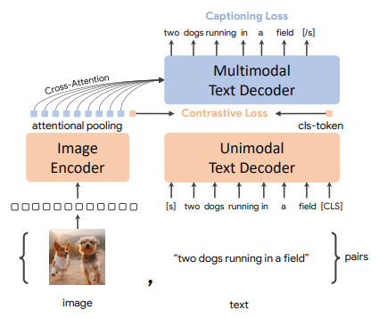
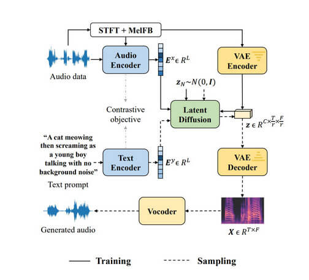
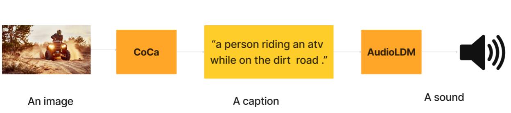
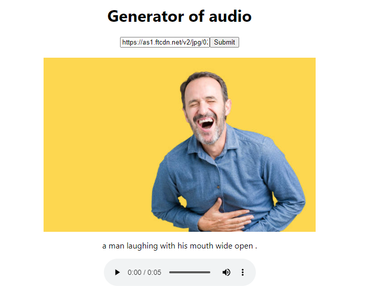

# Generator-of-audio-from-images

In this repository a pipeline is registered that is able to generate audio when it receives an image as input. In order to carry out this process, two models are connected.  

## Contractiva Captioner (CoCa)

The first one is Contractive Captioner (CoCa) is a model that given an image is able to describe what happens in that image. CoCa develops its architecture following two approaches, first it uses the image encoder and the text decoder to obtain the unimodal text representations by omitting the first layers of the decoder. In the next step, these layers are used to obtain the multimodal image and text representations. To train CoCa, the constrant losses between the output of the image encoder and the unimodal text decoder are used to compare the image and text representations. Also, the subtitle generation losses in the output of the multimodal decoder are used, which help the model to predict the text tokens in an autoregressive way. Furthermore, this form of training will allow the model to be able to capture both global and regional characteristics of images and texts. 


<div align="center">
  
</div>


The data that the model uses for training is of low quality, both text and images, which allows the model to learn generic representations and these can be transferred to different tasks by making small adaptations or knowledge transfer.


Coca is able to perform a multitude of tasks: visual recognition, image caption generation, multimodal understanding, label-free image classification, label-free image retrieval... Additionally, the Contrastive Captioner (CoCa) model has been shown to outperform other models by being able to perform label-free transfer.

## AudioLDM
The second model used is AudioLDM emerges as a Text-to-Audio (TTA) system that uses a latent space to learn continuous audio representations from constrained language-to-audio pre-training (CLAP). The CLAP model allows training the latent space with audio embeddings conditioned by text embeddings, which enables AudioLDM to generate quality audio with high computational efficiency. That is, AudioLDM learns to generate an audio in a first stay in a latent space encoded by a VAE, develops that latent space conditioned by audio embeddings and constraining text embeddings pre-trained by CLAP. This fact allows CLAP to generate sound without using language-audio data pairs to train the LDM. In short, the AudioLDM model is a model that combines constractive language-to-audio pre-training (CLAP) with conditional latent diffusion models with the aim of generating high quality audio from text descriptions. The following figure shows the AudioLDM architecture, showing how the audio and text samples are obtained thanks to CLAP and how the VAE is used to encode a conditioned latent space from which the generated audio samples are obtained:
<div align="center">
  
</div>

## Pipeline

Once the models used have been explained, the implementation followed in the development of the pipeline capable of generating audio when it receives an image as input. First of all, we studied how CoCa was implemented and how it could be used within the pipeline. It was discovered that in Huggingface is uploaded the code to be able to use CoCa. This code mainly takes the image and generates a description for that image. The same search process was done for the AudioLDM model, also a small pipeline was found that is able to generate audio from text. With all this, both models were put together, the output description of the first model was used as input for the second model. The pipeline has the following form:

<div align="center">
  
</div>

Once implemented, a web page is created to run the pipeline, in which the user types the url of the image to be sounded and the audio generator will sonarise the image.


<div align="center">
  
</div>

## Steps to follow
1. Clone the repository and navigate to where the code is:
   ```console
      git clone https://github.com/Laurafdez/Generator-of-audio-from-images.git
      ```
2. Navigate to where the code is:
   ```console
     cd /Generator-of-audio-from-images/src
      ```
       
2. Create an environment in which to put the pipeline to work:
   ```console
     conda create --name pipeline
     ```
3. The created environment is activated:
   ```console
     conda activate pipeline
     ```
4. Environmental dependencies are installed
   ```console
     pip install Flask open_clip_torch torch Pillow diffusers torchvision scipy flask-cors requests soundfile numpy
     ```
5. Once all the dependencies have been installed, the pipeline.py script is put into operation.
    ```console
       python pipeline.py
   ```

6. On another terminal, another environment is created where the node application is run:
    ```console
       conda create --name node_js
   ```
7. The created environment is activated:

    ```console
       conda activate node_js
   ```
8.  Node is installed in the environment:

    ```console
       conda install -c conda-forge nodejs
    ```
9.  Moves to where the code is:

    ```console
       cd src
    ```
10. Dependencies are installed:
    ```console
       npm install
    ```
11. The application is run:
    ```console
       npm start
    ```
12. The website is up and running and you can enter the URL of the images..

## References

1. Yu, J., Wang, Z., Vasudevan, V., Yeung, L., Seyedhosseini, M., & Wu, Y. (2022). Coca: Contrastive captioners are image-text foundation models. arXiv preprint arXiv:2205.01917.
2. Liu, H., Chen, Z., Yuan, Y., Mei, X., Liu, X., Mandic, D., ... & Plumbley, M. D. (2023). Audioldm: Text-to-audio generation with latent diffusion models. arXiv preprint arXiv:2301.12503.
